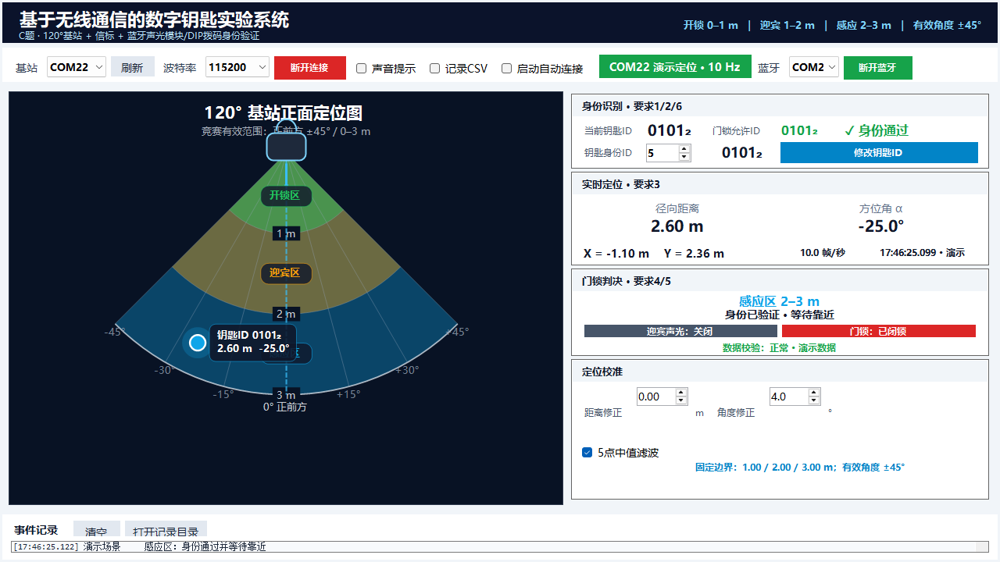
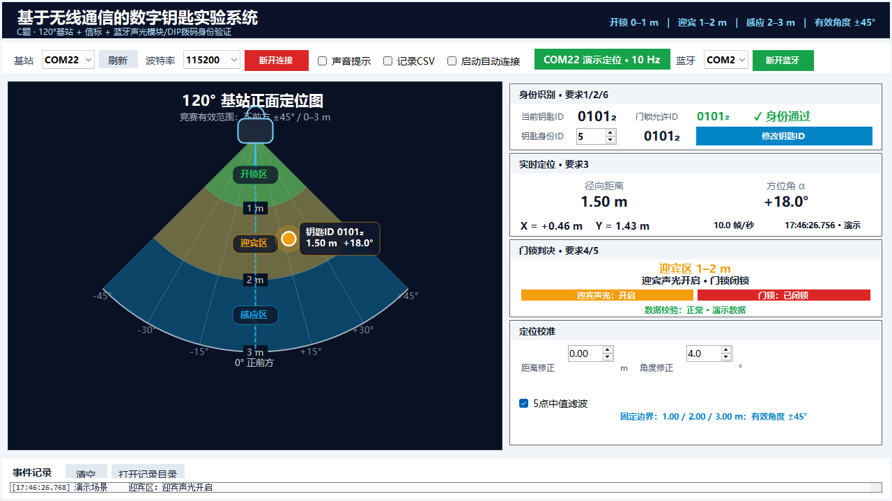
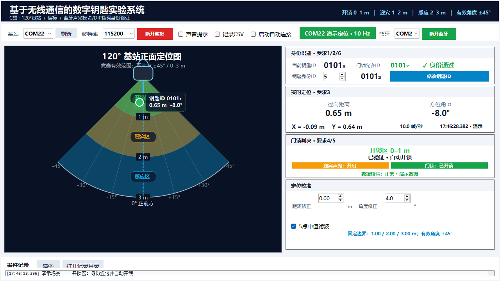
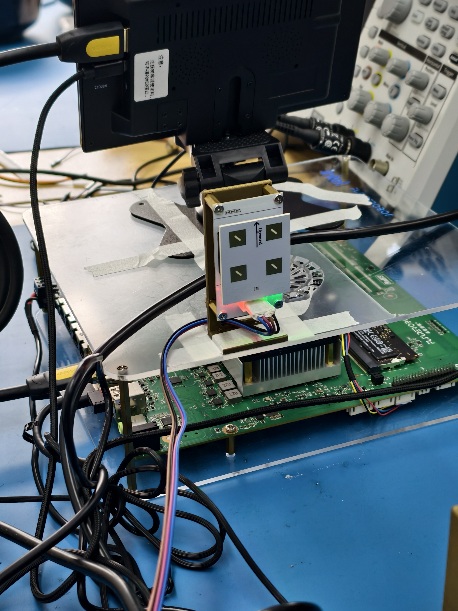
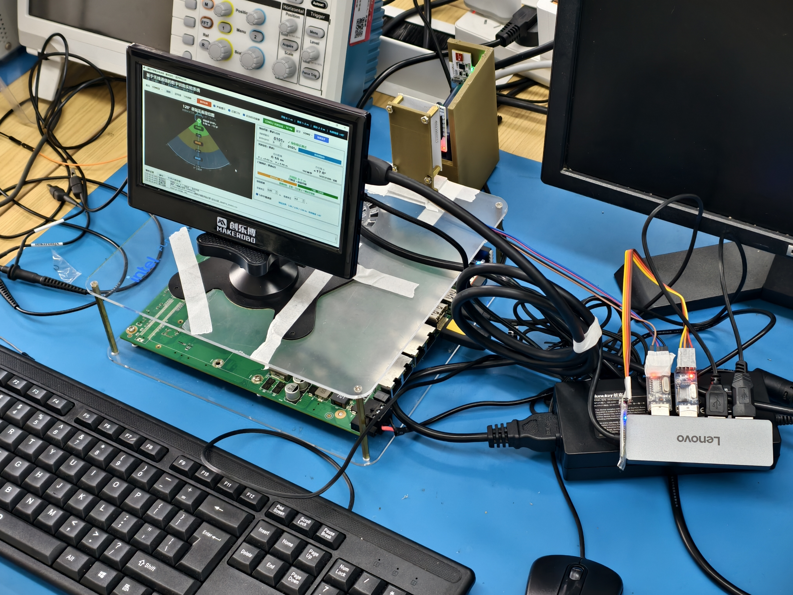
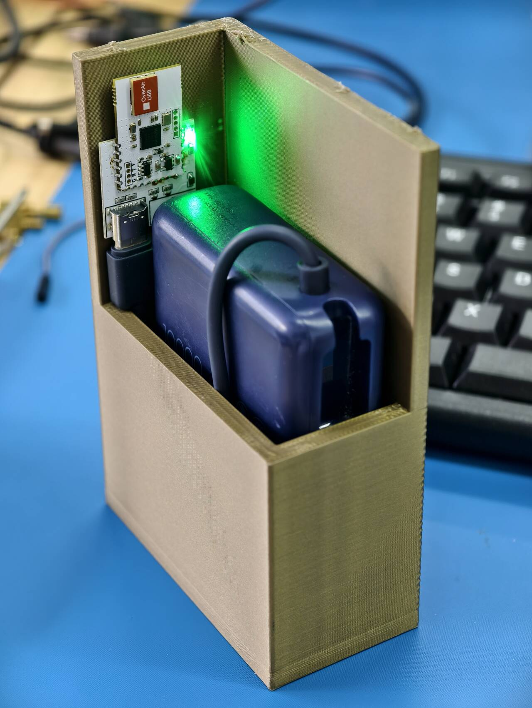
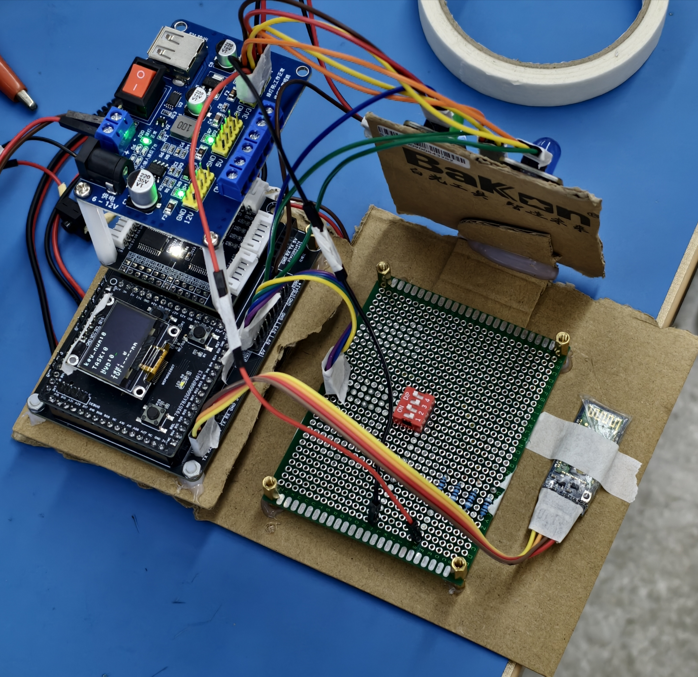
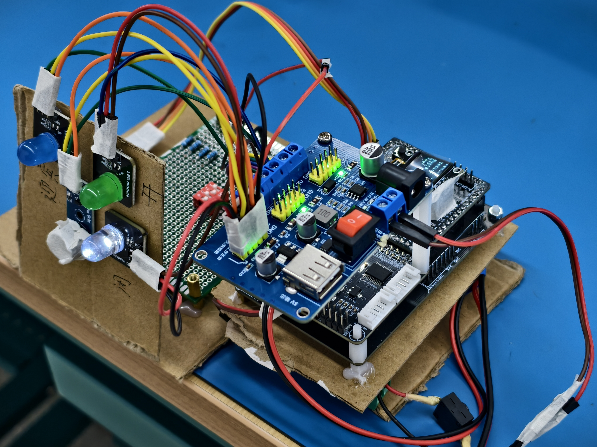
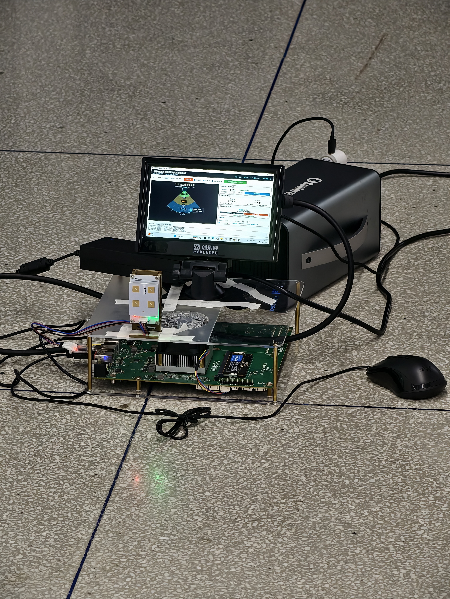

# 2026 电赛 C 题：数字钥匙实验系统

本仓库保存 C 题数字钥匙实验系统的 Windows 上位机、声光控制模块固件、项目网站、定位套件开发资料和 2026 电赛原题合集。

> 🌐 **项目网站：** [在线查看 2026 电赛 C 题数字钥匙实验系统](https://qiushi0919.github.io/2026-NUEDC-C/)
>
> 📦 **GitHub 仓库：** [Qiushi0919/2026-NUEDC-C](https://github.com/Qiushi0919/2026-NUEDC-C)

## 软件运行截图

| 感应区：身份通过，等待靠近 | 迎宾区：迎宾声光开启 |
| --- | --- |
|  |  |
| `2.60 m / -25.0°` | `1.50 m / +18.0°` |

| 开锁区：身份通过，自动开锁 | 开锁区：身份不匹配，保持闭锁 |
| --- | --- |
|  |  |
| `0.65 m / -8.0°` | `0.75 m / +10.0°` |

## 实物与测试照片

### 智能门锁整体

| 智能门锁整体一 | 智能门锁整体二 |
| --- | --- |
|  |  |

### 数字钥匙与声光控制模块

| 数字钥匙 | 声光控制模块 | 声光模块接线 |
| --- | --- | --- |
|  |  |  |

### 测试场景



## 项目资料

- [2026 年电赛原题合集](resources/2026年电赛原题合集/)
- [C 题原题 PDF](resources/2026年电赛原题合集/C题_基于无线通信的数字钥匙实验系统.pdf)
- [ALX-AOA-FIT 定位套件开发资料](resources/ALX-AOA-FIT定位套件开发资料/)
- [项目网站源码](website/)

第三方厂商软件、驱动和压缩包仅作为开发资料归档，运行前请自行确认来源并进行安全检查。

## 系统链路

```text
120° 定位基站 → Windows 上位机 → 蓝牙串口 → MSPM0G3507 声光控制模块
                                           └→ DIP 拨码开关允许放行 ID
```

- 定位基站和蓝牙模块分别连接 Windows 串口。
- 蓝牙控制链路使用 `115200 8N1`。
- 声光控制模块周期上报门锁 DIP 设置的 4 位允许放行 ID，上位机将它与软件设置的钥匙身份 ID 比对。
- 没有收到新鲜的 DIP 允许 ID 时系统保持闭锁。定位基站固定使用 `COM22`，蓝牙声光模块固定使用 `COM21`；程序启动后持续检测并每约 2 秒自动重连，设备中途掉线后也会恢复连接。
- 距离和方位角先经过可选的 5 点中值抗异常滤波，再经过可配置的输出平滑；输出平滑默认取最近 30 个有效点的中值，也可在界面中修改窗口长度或切换为均值。
- 控制帧采用 `AA 55` 帧头和 CRC16 校验，具体见协议文档。

## 目录结构

```text
pc-software/                    Windows WinForms 上位机源码与协议测试
firmware/sound-light-controller/ MSPM0G3507 声光、蓝牙和 DIP 固件
Figs/                            软件运行截图与项目实物照片
resources/                       原题合集与定位套件开发资料
website/                         项目展示网站源码
```

## 快速启动

- 本机可双击仓库根目录的 `启动数字钥匙软件.lnk`，直接运行已安装的软件。
- 公开仓库中提供 `启动数字钥匙软件.cmd`；安装 .NET 7 SDK 后双击即可从源码启动。

## 上位机编译与测试

需要安装 .NET 7 SDK。在仓库根目录执行：

```powershell
dotnet build .\pc-software\src\DigitalKeyDisplay\DigitalKeyDisplay.csproj -c Release
dotnet run --project .\pc-software\tests\ProtocolSmoke\ProtocolSmoke.csproj -c Release
```

上位机启动后，选择定位基站串口和蓝牙控制串口，蓝牙串口波特率固定为 `115200`。两个设备应使用不同的 COM 口。

隐藏截图演示参数为 `sensing`、`welcome`、`unlock` 和 `mismatch`，例如：

```powershell
dotnet run --project .\pc-software\src\DigitalKeyDisplay\DigitalKeyDisplay.csproj -c Release -- --demo=unlock
```

## 控制模块说明

- 蓝牙串口：`PA10` 为 TX，`PA11` 为 RX。
- `SW1～SW4` 对应身份 ID 的 `bit3～bit0`，低电平有效，拨到 ON 记为 `1`。
- `PA18`、`PB19`、`PA8` 分别控制三路指示灯，`PA27` 控制蜂鸣器。
- 控制模块约每 100 ms 上报一次 ID；上位机约每 100 ms 下发一次门锁状态。
- 超过约 500 ms 未收到有效控制帧时，固件进入安全状态并关闭声光输出。

固件工程入口位于 `firmware/sound-light-controller/keil/`，需要对应的 Keil/ARM 工具链编译。

## 协议文档

- 上位机联调说明：`pc-software/CONTROL_LINK.md`
- 控制模块协议：`firmware/sound-light-controller/Doc/Digital_Key_UART_Protocol.md`
- 蓝牙说明：`firmware/sound-light-controller/Doc/Bluetooth_Protocol.md`
